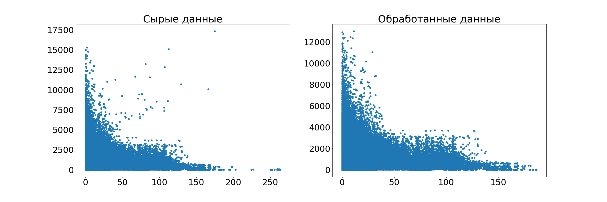
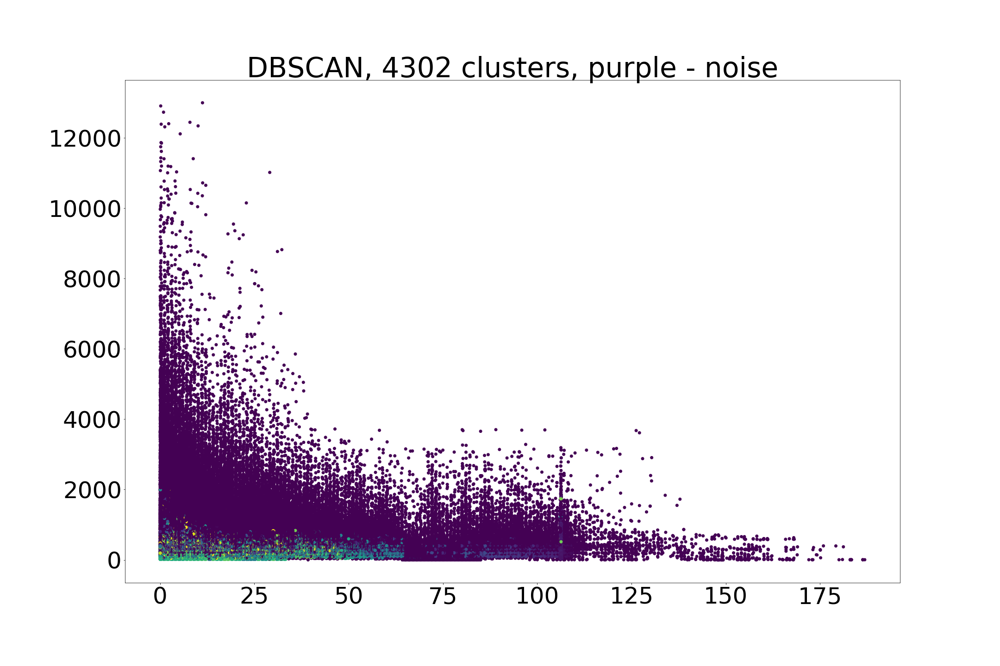
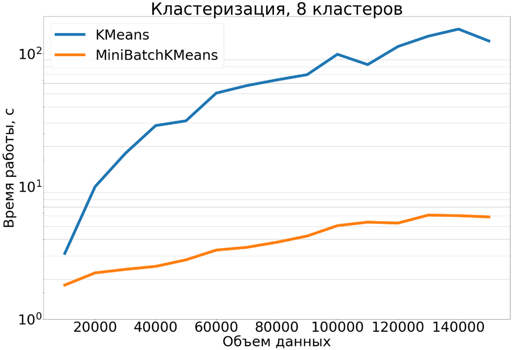
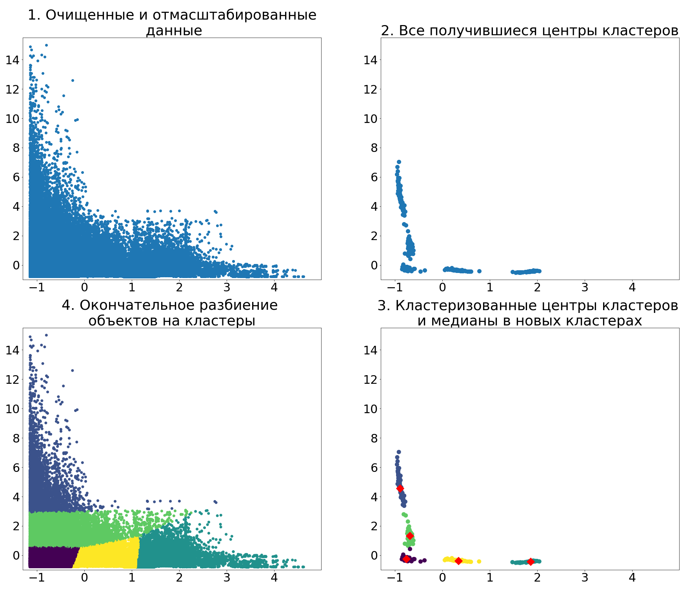
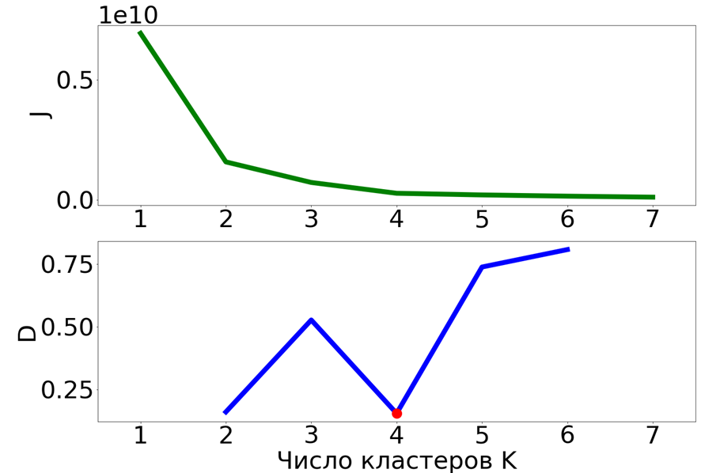
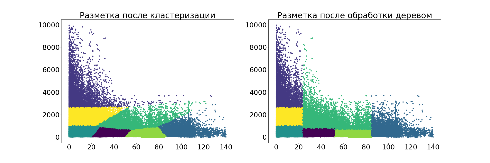
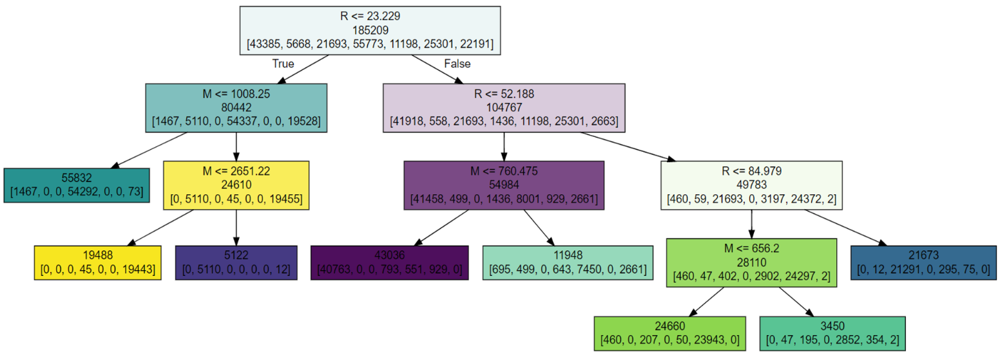
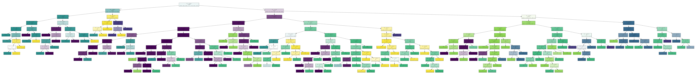

# RFM-анализ на алгоритмах Machine Learning

## Предыстория

У нас есть практически все для удовлетворения самых неожиданных потребностей клиентов: email-рассылки, вебпуши, рекомендации, десятки супер-полезных отчетов и многое другое. Но до недавнего времени у нас не было ничего, связанного с [Machine Learning](http://www.machinelearning.ru/wiki/index.php?title=Заглавная_страница). А ведь это тренд и его стоит придерживаться, кроме того, судя по событиям в мировом технологическом прогрессе ML может принести немалую пользу.

Одной из первых наших задач в этой области стал RFM-анализ.

## Пара слов про RFM

Если коротко, то дело было примерно так &mdash; собрались несколько бородатых маркетологов со стажем и обсуждают проблему:
>&mdash; Вы слышали, что индивидуальный подход к клиентам существенно повышает прибыль и снижает отток?

>&mdash; Ага, только если я 500k своих клиентов буду индивидуально обрабатывать, разорюсь раньше, чем замечу эффект.

>&mdash; Так ты их на группы раздели, чтобы в каждой похожие клиенты были, тогда только несколько групп будешь индивидуально обрабатывать.

>&mdash; Отличная мысль. Только вот у меня про каждого столько инфы, мне их как лучше группировать, по имени или по фамилии?

>&mdash; Да ты их по RFM группируй, результат что надо будет, точно говорю!

**[RFM](https://ru.wikipedia.org/wiki/RFM-анализ)** это:

+ *R* (Recency) &mdash; насколько давно клиент сделал свой последний заказ;
+ *F* (Frequency) &mdash; сколько заказов всего сделал клиент (не думайте про перевод, тут речь не про интервалы);
+ *M* (Monetary) &mdash; сколько денег клиент потратил.

Есть еще расширения всякие, но пока и этого 3D-пространства вполне достаточно.

Сейчас многие используют RFM-анализ, о том как они его делают можно почитать [на хабре](https://habr.com/company/unisender/blog/131225/) или на сайтах компаний: у [Putler](https://www.putler.com/rfm-analysis/) и [Betaout](https://www.betaout.com/learn/use-rfm-analysis-segmentation-boost-business-3x/), например, неплохая визуализация (не могу только понять, как она вышла одинаковой у разных компаний). 

Подход у всех схожий.

Сначала клиентов делят на несколько (обычно, три, четыре или пять) групп по каждому признаку, согласно распределению значений давности, частоты и величины покупок.
Четыре группы с тремя переменными образуют 4x4x4 = 64 клиентских сегмента. А если на 5 групп? Будет уже 125 сегментов. 27 или 8, конечно, проще, но про качество можно забыть.

Ну ладно, делить так делить. Стоп. А как делить? Основная сложность &mdash; определить границы групп. В способе их определения как раз и состоит основное отличие между существующими подходами. Что предлагают:  

1.	Разделение на равные по диапазону значений части. Например, если наименьшее количество покупок среди всех покупателей &mdash; 1 (одна), наибольшее &mdash; 90, а деление происходит на три части, то в первой группе окажутся люди, имеющие от 1 до 30 покупок, во второй &mdash; от 31 до 60, а в третьей &mdash; от 61 до 90.
 Особенности:
  + Легко автоматизировать;
  + Более или менее адекватно выявляются VIPы;
  + Все остальное плохо, т.к. распределение, как правило, неравномерно: в примере в первой группе может оказаться 99% клиентов, во второй &mdash; 0,99%, а в третьей &mdash; 0,01%, поэтому бОльшая часть клиентов оказывается неразделенной.
2.	Разделение на равные по количеству объектов группы &mdash; квантили (квартили / квинтили). Такой подход применяется чаще предыдущего.
 Особенности: 
  + Также легко автоматизировать;
  + Группы более «разумные»; 
  + Однако недостатков по-прежнему больше, чем достоинств &mdash; как правило, на самом деле «лучших» клиентов (например, покупающих чаще всего) значительно (на несколько порядков) меньше чем худших, но здесь они не выделяются правильно в отдельную группу.  
3.	Ручной подход. Специалист с аналитическими навыками изучает базу данных и подбирает правильное разделение. 
 Особенности: 
  + Неплохие результаты;
  + Огромные временнЫе затраты и необходимость наличия специалиста.

Конечно, сделать новый продукт со старыми недостатками не хотелось, поэтому первые 2 варианта выкинули сразу. Последний подход реализовать нереально &mdash; многовато аналитиков потребуется (у нас ведь не один проект).

Когда сегменты выделены, нужно придумать, что с ними делать &mdash; какие маркетинговые кампании запустить (ну не для красоты же мы их выделяли). Кстати, вы можете придумать 125 кампаний для сегментов? Нет? А 64, хотя бы? Тоже нет? Ну ничего, никто этого и не делает.
Обычно выделяются наиболее важные сегменты с точки зрения специалистов-маркетологов (5-15 штук) – как правило, это крайние сегменты. И для них уже предлагаются кампании по увеличению их маркетинговой ценности.

**Что нам во всем этом процессе не нравится:**

1. Очевидно, основное &mdash; процесс разделения на сегменты. Тут явно требуется что-нибудь новенькое.
2. Количество сегментов. Не очень здорово, что большинство клиентов остаются без внимания.
3. Маркетолог должен вручную подбирать кампании. Зачем напрягать человека, пускай бы лучше машинка это делала.

Ну, а что нам не нравится, мы будем исправлять. По крайней мере, отчасти.

## Новый подход к RFM анализу

Долго-долго мы думали, как же избавиться от всех недостатков и сделать идеальный RFM. Ничего хорошего не придумав, решили попробовать под эту задачу методы [кластеризации](https://ru.wikipedia.org/wiki/Кластерный_анализ) &mdash; это методы машинного обучения, которые относятся к классу "[обучение без учителя](https://ru.wikipedia.org/wiki/Обучение_без_учителя)". Без учителя потому, что имея под рукой много данных, с ними нужно что-то сделать, а как это делать никто не объяснил.

Как станет ясно позже, они не предназначены для такого рода задач, однако иного выхода не было.

**P.S.**
Вот я сейчас рассказываю и вроде как намекаю, что никто до нас этого не делал, ну или, по крайней мере, не говорил об этом. На самом деле это не так &mdash; удалось откопать одну [статью](http://www.kimberlycoffey.com/blog/2016/8/k-means-clustering-for-customer-segmentation), в которой автор проводит научное исследование на эту тему. Но, как мы поняли на собственном опыте, от науки до бизнеса совсем не один шаг.

В общем, была у нас идея и мы наивно думали, что идея &mdash; это полдела. Как же мы ошибались.
Но обо всем по порядку.

### О данных
Опущу историю о том как достать данные, будем считать,что они уже есть.
То есть для каждого клиента магазина имеются следующие данные:

* R &mdash; количество дней (дробное), прошедшее с момента последней успешной (не отмененной и т.п.) покупки;
* F &mdash; количество совершенных покупок (заказов) - точнее, дней с заказами;
* M &mdash; общая потраченная сумма.

На самом деле такие данные есть не для всех клиентов, а только для тех, кто что-то купил (ну, а иначе, для тех, кто ничего не купил, какое значение будет у R?).
А как быть с клиентами без покупок? Можно, конечно, выделить их в отдельный сегмент. Но, как выяснилось, у разных магазинов их количество может достигать 20, 50, 80, 95 или даже 100 процентов от общего числа (хотя, конечно, последним наш RFM вряд ли поможет). Так что не помешает их тоже разделить &mdash; по единственному признаку, которым мы можем их описать &mdash; времени жизни (нет, я не про возраст, я про время нахождения в БД).

### Задача

Нужно сделать штуку, которая сможет самостоятельно выделять RFM сегменты в основных данных (т.е. среди клиентов с покупками) и D (от Duration) сегменты в данных клиентов без покупок (D-данных).

Требования такие:

* Сегментов должно быть не мало и не много, в пределах 3-15 шт. в основной части и 1-5 шт. в D-части (из соображений здравого смысла и удобства);
* Сегменты должны быть прямоугольными, т.е. их границы д.б. параллельны координатным плоскостям. Или состоять из нескольких таких прямоугольных блоков (нескольких, не значит 100500+). Во-первых, это требование системы &mdash; иначе их невозможно будет выделить. Во-вторых так понятнее для человека.

### Подготовка

Ясное дело, прежде всего данные нужно очистить (ну, типа все величины неотрицательные). Об этом не буду подробно, скажу лишь, что обычно все было хорошо и лишь изредка на данном этапе отбрасывались 2-3 экземпляра.

Следующий этап &mdash; удаление выбросов.

На картинке ниже пример исходных данных и данных, которые хотелось бы видеть после обработки (здесь и далее использую 2D графику вместо 3D для понятности, а также иногда не подписываю оси, где это не имеет особого значения).

	
    <i>Примеры данных: исходные (слева) и очищенные от выбросов (справа)</i>

Тут сразу становится понятно, зачем нужен этот этап &mdash; без него, например, клиент, который на самом верху левой картинки имеет все шансы стать отдельным сегментом...

Чтобы отделить выбросы, проще всего просто обрезать концы (ну, по 2 [перцентиля](https://en.wikipedia.org/wiki/Percentile) сверху, скажем).

Можно так и сделать, но мы предпочли применить более умный метод &mdash; в качестве него выбрали [Local Outlier Factor](http://scikit-learn.org/stable/auto_examples/neighbors/plot_lof.html#sphx-glr-auto-examples-neighbors-plot-lof-py). Этот нехитрый алгоритм сравнивает плотность каждого объекта с плотностям его соседей (а плотность объекта обратно пропорциональна расстоянию до ближайших соседей). Те, у кого это отличие наиболее значительно, считаются аномалиями. Только надо не забыть нормировать как-нибудь данные, а то он вас не поймет (ну, скажем, по M разница между соседями 1000, а по F &mdash; 1, нехорошо).

Обычно он помогает и оставляет после себя чистые данные. Но не всегда. На D-части от него вообще толку немного, а зависнуть может, так что там без него &mdash; просто обрезаем правый конец немного.

Когда все это сделали, проверяем, что данные годятся для сегментации. Проверочка субъективная вышла:
* Число клиентов с покупками &mdash; не меньше 25000. Понятно, что ограничивать надо, иначе ерунда может получиться. 
* Число заказов &mdash; не меньше 50000. Вот тут, пожалуй, стоит смягчить.
* Последняя покупка &mdash; не более 1,5 дней назад (ну не будем же мы дохлые проекты сегментировать &mdash; только электроэнергию понапрасну тратить).

### Кластеризация

Наконец, дошли до самого интересного.

Имеем хорошие данные, собираемся их кластеризовывать.
[Кластеризация](https://ru.wikipedia.org/wiki/Кластерный_анализ) &mdash; это поиск структуры в данных и выделение в них групп *похожих* (по какой-либо метрике) объектов.

Тут раздолье &mdash; алгоритмов целая куча. Вот несколько из них и заодно задачи, с которыми они готовы работать (заметьте, что это не слишком похоже на то, что есть у нас).

	
    <i>Примеры работы алгоритмов кластеризации из документации пакета scikit-learn</i>

Здесь 9 алгоритмов, и это далеко не все, но мы решили ограничиться ими, как самыми популярными.

Что ж, сравним.

Понятно, что когда кластеры &mdash; это отдельные шарики, разделить их труда не составляет.А как насчет чего поинтереснее? Казалось бы, те, кто справляется с задачей разделения колечек (верхняя линия на картинке), самые лучшие. Но беда в том, что у нас далеко не колечки.

В общем, мы честно перепробовали все эти алгоритмы. Те из них, которые количество кластеров подбирают сами, дают либо порядка 1000 штук, либо вообще 1 или 2. Ну да, это вам не колечки разделять. Про время работы и требования к памяти некоторых я вообще молчу. А про количество [гиперпараметров](https://www.quora.com/What-are-hyperparameters-in-machine-learning), которые непонятно, как настраивать, чтобы всегда хорошо работало, тем более.

Возьмем алгоритмы попроще &mdash; те, что спрашивают у нас, сколько кластеров найти. Проблемы с гиперпараметрами и ресурсами  у многих остаются. На полном серьезе: 50k сэмплов &mdash; это максимум, на что хватает моих 16Гб памяти, например для популярной агломеративной иерархической кластеризации. При этом время кластеризации ~5&ndash;10 минут. Скажете, сервер мощнее? Да, только 50k &mdash; это игрушечный пример, а что делать, когда будет хотя бы 500k? И вот еще проблема: многие из них плотностные, т.е. ищут кластеры как плотные сгустки объектов. Что же в этом плохого, спросите вы? По большому счету ничего, они как раз для этого создавались, и это правильно. Только вот, если помните, нам нужны будут прямоугольные сегменты, а плотные сгустки могут иметь форму весьма странную, и распределять их по прямоугольникам было бы весьма проблематично.

С примером с картинок выше, где число объектов составляет ~185k такие алгоритмы как Affinity Propagation, Agglomerative Clustering, Spectral Clustering, Birch, Ward, Mean Shift (про всех них можно почитать [в официальной документации scikit-learn](http://scikit-learn.org/stable/modules/clustering.html)) на моей машинке не справились &mdash; отваливались по памяти сразу либо комп зависал намертво.

Вот результат, который удалось получить при помощи DBSCAN, который счел 55% объектов шумом, а остальные 84k разделил на 4302 кластера:

	
    <i>Результат сегментации DBSCAN</i>

В конце концов, после недели бесплодных экспериментов мы пришли к выводу, что не найдем ничего лучше, чем k-means. Да, тот самый простой и банальный k-means, который изучают на вводных курсах по ML. Его прелесть в том, что он не ищет никаких сгустков, которых в наших данных попросту нет, а просто группирует точки вокруг центров. И это работает.

Писать свой k-means не стали, а использовали [версию scikit-learn](http://scikit-learn.org/stable/). А еще там есть модификация [MiniBatchKmeans](https://algorithmicthoughts.wordpress.com/2013/07/26/machine-learning-mini-batch-k-means/). Эта штука очень похожа на [SGD (Stochastic Gradient Descent)](https://en.wikipedia.org/wiki/Stochastic_gradient_descent) &mdash; центры кластеров на каждой итерации пересчитываются не по всем объектам, а только по небольшой подвыборке. Авторы в своем [эксперименте](http://scikit-learn.org/stable/auto_examples/cluster/plot_mini_batch_kmeans.html#sphx-glr-auto-examples-cluster-plot-mini-batch-kmeans-py) показывают, что качество по сравнению с оригинальным k-means почти не падает, зато время сокращается очень существенно (этого нет в эксперименте, но это так).

	
    <i>Сравнение времени работы реализаций KMeans и MiniBatchKMeans в scikit-learn</i>

В принципе, получаемые результаты были вполне разумными. Но была проблема: k-means &mdash; вещь очень неустойчивая (а MiniBatchKMeans и подавно). Неустойчивость заключается в том, что при повторных запусках результаты могут быть разными, т.к. используется элемент случайности. Можно, конечно, зафиксировать генератор случайных чисел, но основная проблема не в этом. Проблема в том, что если завтра хотя бы один из клиентов совершит хотя бы одну новую покупку, то расположение кластеров может существенно измениться.

Решение, которое приходит в голову и которое предлагает интернет, &mdash; запускать кластеризацию повторно. Самый надежный вариант: запускать столько раз, сколько объектов, по очереди исключая 1 объект из выборки. Но когда объектов пара сотен тысяч, процесс может слегка затянуться. Можно исключать не по одному объекту, а какую-то часть, скажем, 1%.
Мы почти так и сделали, только ничего не исключали, а брали разные random state и запускали 100 раз на всех объектах. MiniBatchKmeans работает настолько быстро, что даже на самой объемной выборке &mdash; 2 млн объектов &mdash; эти 100 запусков отрабатывают за несколько минут.

После того, как получены 100 вариантов расположения центров кластеров, они все высыпаются в пространство (например, если делим на 12 кластеров, то это 1200 точек). Обычно они образуют неплохо различимые сгустки, а потому их можно смело кластеризовать тем же k-means. Когда получены кластеры, берем медиану в каждом из них и считаем ее реальным центром кластера. После чего просто определяем, какая точка к какому центру ближе. Весь процесс для отмасштабированных данных представлен ниже.

	
	<i>Полный процесс кластеризации</i>

Еще один вопрос &mdash; как определить количество кластеров. Обычно выполняют несколько кластеризаций на разное число кластеров, а затем по какой-либо метрике оценивают, при каком числе кластеров качество выше. Есть много [метрик](http://scikit-learn.org/stable/modules/clustering.html#clustering-performance-evaluation), которые показывают качество разбиения. Часть из них используют знания об истинном разбиении &mdash; это не для реальных задач. Остальные готовы работать и без этого.
Но из-за структуры данных и ограничения на число кластеров эти метрики (например, популярный [Silhouette](https://en.wikipedia.org/wiki/Silhouette_(clustering)) выдавали результаты не вполне адекватные. 

Поэтому выбор снова пал на самое простое, что можно придумать &mdash; так называемый метод "колена". Сначала считается сумма квадратов расстояний от точек до центроидов кластеров, к которым они относятся &mdash; критерий J на картинке ниже (формулу приводить не буду). Понятно, что чем эта сумма меньше, тем лучше. Но вот только минимум достигается, когда каждая точка являет собой отдельный кластер. Поэтому, обычно, выбирают такое число кластеров, где на графике наблюдается наибольший излом - "колено". В этой точке происходит значительное улучшение качества, значит, вероятно, это оптимальное число кластеров. Такую точку формально определяют по отношению изменения J на участке до этой точке к изменению J на участке после нее &mdash; критерий D.

	
	<i>Оптимизация числа кластеров: критерий J (сверху) &mdash; монотонно убывает,   критерий D (снизу) &mdash; обнаруживает 2 колена &mdash; при 2 и 4 кластерах </i>

На самом деле, в данной задаче в этом методе нет особой необходимости, а потому мы его иногда выключаем и делим просто на 12 кластеров. Практика показывает, что результаты, обычно, неплохие. А количество кластеров, кстати, может уменьшиться позже. Об этом в следующей части.

### Прямоуголизация

Все границы кластеров &mdash; прямые линии, но их наклон может быть произвольным. Выше говорилось, что кластеры должны быть прямоугольными (иметь форму параллелепипедов, грани которых параллельны координатным плоскостям).

То есть нужно вписать кривые сегменты с предыдущей картинки в прямоугольники.

Чтобы выполнить эту задачу мы использовали [Дерево Решений](https://ru.wikipedia.org/wiki/Дерево_решений) (Decision Tree). Этот достаточно простой метод разбивает все пространство на области с помощью условий по каждой оси (например, x > 1 and y < 10 &mdash; область 1 и т.д.). Границы у получающихся областей как раз такие, как нам нужно. Совокупность всех условий образует бинарное дерево, в котором двигаясь от корня к листьям и проверяя выполнение условий можно прийти в любую нужную область.

Алгоритмы, реализующие решающее дерево &mdash; это алгоритмы машинного обучения (класс "[обучение с учителем](https://ru.wikipedia.org/wiki/Обучение_с_учителем)"), они принимают на вход множество точек и метки, которые определяют, к какому классу каждая точка относится. Затем пространство разделяется так, чтобы как можно больше точек с одинаковыми метками оказались в одной области. У нас в качестве меток выступают метки кластеров, полученные на предыдущем этапе.

Можно ли сделать так, чтобы все точки оказались в нужных областях? Разумеется, да. Как это будет выглядеть, покажу чуть позже, а пока просто поверьте, что стремиться к этому не стоит.

Чтобы получить хорошие результаты, нужно ограничивать такие параметры как глубина дерева и число листьев. А то, насколько хорошо их ограничили, проверяется на кросс-валидации &mdash; это процесс, когда дереву для обучения дается только часть объектов, скажем, 2/3, а на остальных проверяется качество. Если дерево будет слишком точно отделять объекты при обучении, то при тестировании новые объекты будут часто попадать в чужие области и качество будет низким. Поэтому качество обычно оказывается высоким при небольших глубине и числе листьев, что нам вполне подходит &mdash; чем меньше областей, тем проще их понять. В качестве метрики качества используем [F-score](https://en.wikipedia.org/wiki/F1_score).

Вот пример того, как происходит чудесное преобразование и какое при этом получается дерево:

    
    
    <i>Работа решающего дерева: распределение объектов по кластерам до обработки деревом и после нее (сверху) и построенное алгоритмом дерево (снизу)</i>
 

А вот обещанный пример того, что может быть, если почти ничего не ограничивать (дерево для тех же данных):

	
	<i>Пример дерева почти без ограничений (число листьев ограничено числом 150, чтобы помещалось на экран, на самом деле их ~1000)</i>

Возвращаясь к предыдущему разделу, скажу, что количество кластеров действительно может уменьшиться: поскольку мы ограничиваем дерево, оно выбирает только наиболее важные области, а если в каком-то из кластеров было слишком мало объектов, он просто перестает существовать.

### Постобработка

На этом, в общем-то, все. Есть список сегментов с их границами. Среди них есть сегменты клиентов с покупками и без. Еще есть сегменты с выбросами, но для простоты мы их пока распределяем по основным сегментам.

Готовые сегменты можно просто выдать списком, чтобы кто-нибудь смотрел и ~~радовался~~ ~~парился~~ придумывал крутые маркетинговые кампании для них. Собственно, это и сделали, добавив краткую статистику типа размера сегмента и среднего чека в нем.

На самом деле, сделали еще супер-крутую штуку &mdash; описание сегментов. Специальная функция смотрит умными глазами на сегменты, берет в руки словарик на 10 Excel-листов и описывает каждый сегмент на живом русском языке, чтобы люди не испытывали тоску, глядя на бездушные цифры. Штука получилась настолько крутая, что никому ее пока не показываем. Само собой, рассказывать как она устроена, тоже не буду.

### Тестирование

Проверить, хорошо ли разделены клиенты, &mdash; задача не из легких.

Самая лучшая метрика для нас &mdash; маркетинговый эффект. Чтобы его измерить, нужно провести AB-тестирование. Например, так: разделить всех клиентов пополам, одной половине продолжать рассылать одинаковые письма, а другой &mdash; письма в соответствии с тем, в какой сегмент попали клиенты. Через несколько месяцев сравнить группы: кто больше покупает, кто чаще открывает письма, где меньше отток и т.д. Понятно, что тут много нюансов, которые нужно учесть, а кроме того, на это нужно время.

В качестве более простой и быстрой метрики использовали контрольную группу: сегментировали клиентов прошлого &mdash; т.е. по состоянию на момент времени в прошлом, например, полгода назад. А затем смотрели, как ведут себя эти клиенты в будущем (в смысле, после того самого момента в прошлом). Ведь смысл RFM-анализа в том, чтобы на основании исторического поведения пользователей определить их будущее поведение. Результаты получились вполне адекватными &mdash; в одних сегментах люди в будущем покупали чаще, в других реже и т.д. Тестирование прошло успешно. Впрочем, основная заслуга тут конечно тех самых ребят, которые сидя за большим круглым столом придумали это слово &mdash; *RFM*.

### Что дальше

Дальше &mdash; совершенство.

С тех пор как в компании впервые произнесли *Machine Learning*, общей целью стала *БЗК* &mdash; *Большая зеленая кнопка*. Это такая кнопка во весь экран, при нажатии на которую всё работает само по себе и приносит хорошую прибыль.

Если говорить про данный проект &mdash; RFM, то его конечная цель &mdash; *Маленькая зеленая кнопка*. То есть, когда человек на нее нажимает, сегменты выделяются автоматически и людям начинают отправляться письма (ну, например). Первая часть уже есть, дело за малым.

В общем, хотим мы, чтобы готовые сегменты машинкой анализировались и ей же решалось, кому скидку дать, кому рекламку послать, кому ничего.

